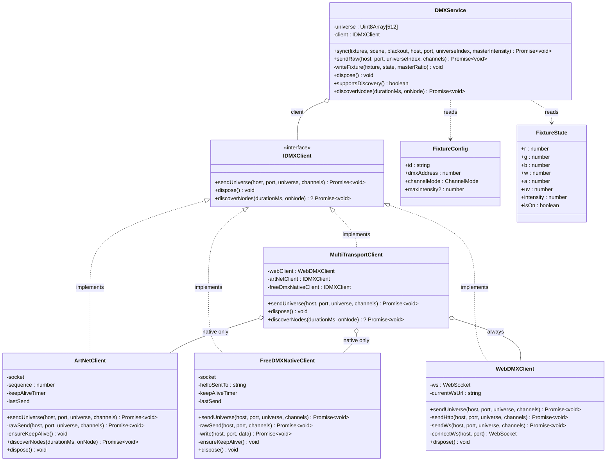
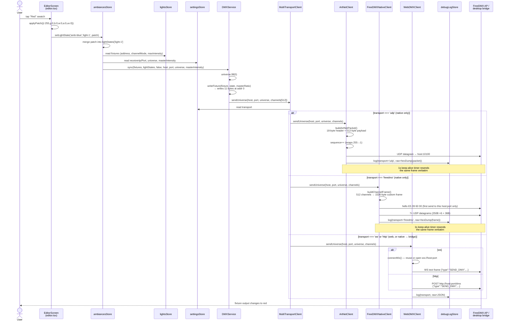

# DMX Packet Protocol — From a Color Tap to a Wire Packet

This document explains, at the byte level, how this app turns "user taps a
color swatch" into a packet that changes a real light's color. It covers
**three wire protocols the app can speak**:

- **Transport A — UDP (Art-Net ArtDMX)**: the standards-based protocol,
  used on Android/iOS to talk directly to the Eurolite FreeDMX AP hardware.
- **Transport B — TCP (WebSocket or HTTP)**: used on Web (which cannot open
  a raw UDP socket at all) and optionally on native too, to talk to the
  desktop visualizer's Python bridge (`dmx-visualizer/server/server.py`)
  instead of real hardware.
- **Transport C — UDP (the device's own original protocol)**: also used on
  Android/iOS, as a fallback — the Eurolite freeDMX AP's *original*
  proprietary protocol, the one its own factory Light'J app actually
  speaks, reverse-engineered and documented here (§11.3) for units whose
  firmware never implements the Art-Net side.

Everything here is derived directly from the code in `src/dmx/` plus the
Eurolite freeDMX AP Wi-Fi Interface manual (No. 51860130). See `CLAUDE.md`
for the higher-level architecture; this document goes one level deeper —
down to individual bytes on the wire.

**Intended use:** this is written to be handed to another developer who has
never seen this codebase, so they can figure out *why a real fixture isn't
responding* without a guided tour. §10 in particular is a debugging companion:
what evidence to pull out of the app, and how to read it against the packet
schemas in §5–§8. §12 is a step-by-step reference covering all four modes
side by side. The worked example throughout (§4, §10.3, §12) uses the app's
actual default fixture — address 1, `DIM16_RGBWAUV`, the 11-channel Cameo
ROOT PAR 6 mode — so the byte-for-byte numbers match what a fresh install
of this app actually sends.

**Is this compatible with the device?** Yes, on two independent paths, so a
given unit only needs to support *one* of them:
- **Transport A (Art-Net)** is verified byte-correct against the official
  spec (§11.1) — correct for any unit whose firmware implements the
  documented "Artnet" tab (§1).
- **Transport C (freeDMX Native)** speaks the device's original protocol —
  the one every unit is guaranteed to implement, since it's what the
  factory Light'J app itself uses, reverse-engineered and reimplemented
  byte-for-byte (§7, §11.3).

If a specific physical unit doesn't respond on one, the fix is switching
Settings → Connection → Transport to the other — not a code change. §12
walks through the exact steps and packets for all four selectable modes
(including Transport B's two sub-modes) so that claim is checkable line by
line rather than taken on faith.

---

## Table of contents

The send path breaks down into four phases, in order — a failure in one
doesn't imply a failure in the ones before it. If you already suspect
roughly *where* it's going wrong, jump straight to that phase:

- **Setup / initialization** — is a socket or connection even open? → [§5.1](#51-socket-setup), [§6.1](#61-websocket-sub-mode), [§7.1](#71-handshake-and-why-theres-no-ack-waiting)
- **Packet construction** — are the right bytes being built? → [§5.2](#52-the-artdmx-packet-opcode-0x5000), [§7.2](#72-the-channel-frame), [§8](#8-channel-mapping-schema-how-colorintensity-becomes-dmx-bytes)
- **Sending** — does the packet actually leave the device? → [§5.3](#53-sending-it), [§6.2](#62-http-sub-mode), [§7.3](#73-sending-it--7-datagrams-not-1)
- **Confirming receipt** — did anything answer, and can you prove it? → [§10](#10-troubleshooting-evidence-to-gather-and-how-to-read-it)

Full outline:

- [1. The physical receiver: Eurolite freeDMX AP](#1-the-physical-receiver-eurolite-freedmx-ap) — the hardware itself: factory IP/port, what it expects
- [2. End-to-end pipeline](#2-end-to-end-pipeline) — the whole chain, tap to wire, on one screen
- [3. Class diagram](#3-class-diagram) — how the pieces of code relate to each other
- [4. Sequence diagram: a worked example](#4-sequence-diagram-a-worked-example-traced-through-the-actual-code) — one real color change, traced call by call
- [5. Transport A — UDP (Art-Net ArtDMX), native only](#5-transport-a--udp-art-net-artdmx-native-only)
  - [5.1 Socket setup](#51-socket-setup) — *initialization*: opening/binding the UDP socket
  - [5.2 The ArtDMX packet](#52-the-artdmx-packet-opcode-0x5000) — *packet*: byte-by-byte layout
  - [5.3 Sending it](#53-sending-it) — *sending*: the actual `send()` call
  - [5.4 Keep-alive (1 Hz)](#54-keep-alive-1-hz) — why a packet still goes out even when nothing changed
  - [5.5 Bonus: ArtPoll / ArtPollReply](#55-bonus-artpoll--artpollreply-network-discovery-not-a-color-send-path) — network discovery, a separate feature from sending color
- [6. Transport B — TCP (WebSocket or HTTP)](#6-transport-b--tcp-websocket-or-http-the-webbridge-path) — web / desktop-bridge path
  - [6.1 WebSocket sub-mode](#61-websocket-sub-mode) — *initialization*: opening the socket
  - [6.2 HTTP sub-mode](#62-http-sub-mode) — *packet + sending* in one call, one request per frame
  - [6.3 The bridge server's receiving side](#63-the-bridge-servers-receiving-side-dmx-visualizerserverserverpy) — what's listening on the other end
- [7. Transport C — UDP (freeDMX native protocol), native only](#7-transport-c--udp-freedmx-native-protocol-native-only) — the device's *original* protocol, a fallback when Art-Net isn't received
  - [7.1 Handshake, and why there's no ack-waiting](#71-handshake-and-why-theres-no-ack-waiting) — *initialization*
  - [7.2 The channel frame](#72-the-channel-frame) — *packet*: a completely different byte layout from Art-Net
  - [7.3 Sending it — 7 datagrams, not 1](#73-sending-it--7-datagrams-not-1) — *sending*
  - [7.4 Keep-alive (1 Hz)](#74-keep-alive-1-hz)
  - [7.5 Disconnect](#75-disconnect)
- [8. Channel-mapping schema](#8-channel-mapping-schema-how-colorintensity-becomes-dmx-bytes) — *packet content*: which byte number is which color (shared by Transports A and C)
- [9. File map](#9-file-map) — every file mentioned in this document, in one table
- [10. Troubleshooting: evidence to gather, and how to read it](#10-troubleshooting-evidence-to-gather-and-how-to-read-it) — **start here if you're diagnosing a specific failure**
  - [10.1 What to hand over](#101-what-to-hand-over-settings--connection-tab) — what to export from the app before asking for help
  - [10.2 Reading a debug-log entry](#102-reading-a-debug-log-entry) — decision tree: no entry / `ok:false` / `ok:true` but nothing happens
  - [10.3 Byte-level sanity check](#103-byte-level-sanity-check-using-the-apps-default-fixture-dim16-11ch) — known-good bytes to compare a capture against
- [11. Prior art & protocol verification](#11-prior-art--protocol-verification) — is this actually correct Art-Net, and has anyone else built this? **includes the research Transport C is based on**
  - [11.1 Art-Net spec compliance](#111-artnetclientts-checked-field-by-field-against-the-art-net-spec)
  - [11.2 Other independent Art-Net implementations](#112-other-independent-art-net-implementations-for-comparison)
  - [11.3 The device's original app doesn't speak Art-Net at all](#113-important-finding-the-devices-original-app-doesnt-speak-art-net-at-all) — the finding Transport C implements
- [12. Step-by-step reference: every mode, side by side](#12-step-by-step-reference-every-mode-side-by-side) — **the answer to "is this compatible?", made checkable**: numbered steps + exact packet bytes for all four selectable modes
  - [12.1 UDP — Art-Net](#121-udp--art-net-transport-a)
  - [12.2 UDP — freeDMX Native](#122-udp--freedmx-native-transport-c)
  - [12.3 TCP — WebSocket](#123-tcp--websocket-transport-b-ws-sub-mode)
  - [12.4 TCP — HTTP](#124-tcp--http-transport-b-http-sub-mode)

---

## 1. The physical receiver: Eurolite freeDMX AP

From the manufacturer's manual:

| Spec | Value | Source |
|---|---|---|
| Model | Eurolite freeDMX AP Wi-Fi Interface (No. 51860130) | manual p.1 |
| Protocol | Art-Net (over WLAN) → converted to real DMX512 on the XLR OUT | manual p.3 |
| Factory IP (Access-Point mode) | `192.168.4.1` | manual p.10/20 "Technical specifications" |
| Factory UDP port | **`10100`** (its own **System → UDP-Port** field — *not* the Art-Net-standard `6454`) | manual p.8/18 "System" table |
| WLAN standard | IEEE 802.11 b/g/n, 2.4 GHz, 11 channels | manual p.3, p.10/20 |
| Range | 30 m indoors / 60 m outdoors | manual p.3 |
| DMX output | 1 universe (512 channels) over a 3-pin XLR "DMX OUT" | manual p.10/20 |
| DMX input (optional) | 3-pin XLR "DMX IN" — an alternative wired source; relayed via relay contact if the device loses power; WiFi/Art-Net always takes priority over this input when both are present | manual p.6/16, p.16 |
| Art-Net Net/Subnet/Universe | Configurable in the device's own web UI, "Artnet" tab — default `0/0/0`, must match `settingsStore.universe` in this app | manual p.9/19 |
| DMX output refresh rate | Configurable on-device, "DMX" section, default **44 Hz** — independent of how often the app itself sends frames | manual p.8/18 |
| Connection-loss behavior | Configurable on-device: hold last DMX data / send nothing / pass through the physical DMX IN | manual p.8/18 |

Two config surfaces exist and are easy to conflate:
- **This app's Settings tab** (`src/store/settingsStore.ts`) — controls what *this app* sends: destination IP, destination UDP port, Art-Net universe, transport (UDP / FreeDMX Native / WS / HTTP).
- **The device's own web config** at `http://192.168.4.1` (a page served *by the FreeDMX AP itself*, reached with a browser after joining its WiFi) — controls what the *device* expects to receive: its UDP-Port, Art-Net Net/Subnet/Universe, device name. These two must agree or nothing arrives (see `CLAUDE.md` → "Debugging a Failed Show").

One more thing worth knowing up front, covered in full in §11.3: this
device's factory protocol — the one its own Light'J app speaks — is **not**
Art-Net. The "Artnet" tab above is a documented, later-added alternative.
Both protocols target the same IP and port; this app implements both
(Transport A and Transport C) and lets you pick per Settings → Connection → Transport.

---

## 2. End-to-end pipeline

```
 UI (Panel 2 color swatch / slider)
   │  onSelectColor / onChange
   ▼
 useAmbiancesStore.setLightState(ambianceId, lightId, patch)   [src/store/ambiancesStore.ts:327]
   │  merges patch into ambiance.lightStates[lightId]
   │  if this ambiance is the currently-active one → sendDMX(...)
   ▼
 sendDMX(lightStates, blackout)                                [src/store/ambiancesStore.ts:152]
   │  reads fixture list from useLightsStore (address, channel mode, max intensity)
   │  reads receiverIp / receiverPort / universe / masterIntensity from useSettingsStore
   ▼
 dmxService.sync(fixtures, lightStates, blackout, host, port, universe, masterIntensity)
                                                                 [src/dmx/DMXService.ts:29]
   │  fills a 512-byte Uint8Array universe buffer
   │  writeFixture() maps each fixture's color+intensity → DMX bytes at its address
   ▼
 client.sendUniverse(host, port, universe, channels)            [src/dmx/DMXService.ts:49]
   │  client = MultiTransportClient                             [src/dmx/MultiTransportClient.ts]
   │  picks the actual wire protocol per useSettingsStore().transport
   ├─ transport === 'udp' (native only) ─────────────► ArtNetClient.sendUniverse       → Transport A (UDP, Art-Net)
   ├─ transport === 'freedmx' (native only) ─────────► FreeDMXNativeClient.sendUniverse → Transport C (UDP, device-native)
   └─ transport === 'ws' or 'http' (web, or native → bridge) ─► WebDMXClient.sendUniverse → Transport B (TCP)
```

Every `DMXService` instance owns the app's single **512-byte universe
buffer** (`this.universe`, `DMXService.ts:25`) — it is rebuilt from scratch
(`.fill(0)`, `DMXService.ts:38`) on every `sync()` call, so a light that
should be off simply never gets its bytes written and stays `0`. That
512-byte buffer is what gets *encoded* differently per transport — Art-Net
sends its bytes essentially unmodified (§5.2), the freeDMX-native transport
repacks every one of them into a 3-byte structure of its own (§7.2).

---

## 3. Class diagram

The types and classes in `src/dmx/`, and how `DMXService` composes them.
`ArtNetClient`, `FreeDMXNativeClient`, and `WebDMXClient` are three
interchangeable implementations of the same `IDMXClient` contract —
`MultiTransportClient` picks between them per-call, and `DMXService` never
sees the difference:



---

## 4. Sequence diagram: a worked example, traced through the actual code

Scenario: Panel 2 is open, editing ambiance `amb-blue`, light `light-1`
(default rig: `dmxAddress: 1`, `channelMode: 'DIM16_RGBWAUV'` — see
`src/store/lightsStore.ts:48-58`). The user taps the **Red** swatch.



1. **`SimpleColorPicker`'s `onSelectColor`** fires in the editor screen:
   ```ts
   // app/(tabs)/editor.tsx:229
   onSelectColor={(nr, ng, nb, nw, na, nuv) =>
     applyPatch({ r: nr, g: ng, b: nb, w: nw, a: na, uv: nuv, isOn: true })}
   ```
   For "Red" this resolves to `applyPatch({ r: 255, g: 0, b: 0, w: 0, a: 0, uv: 0, isOn: true })`.

2. **`applyPatch`** (`app/(tabs)/editor.tsx:82-87`) forwards the patch to the store:
   ```ts
   setLightState(editingId, selectedLightId, patch)
   // → setLightState('amb-blue', 'light-1', { r: 255, g: 0, b: 0, w: 0, a: 0, uv: 0, isOn: true })
   ```

3. **`setLightState`** (`src/store/ambiancesStore.ts:327-341`) merges the
   patch into `ambiances['amb-blue'].lightStates['light-1']`, then — because
   `amb-blue` is the active ambiance, blackout is off, and no effect is
   running on that light — calls `sendDMX(updated.lightStates, false)`.

4. **`sendDMX`** (`src/store/ambiancesStore.ts:152-165`) builds the fixture
   list from `useLightsStore` and reads network config from
   `useSettingsStore`, then calls:
   ```ts
   dmxService.sync(fixtures, lightStates, false, receiverIp, receiverPort, universe, masterIntensity)
   ```

5. **`DMXService.sync`** (`src/dmx/DMXService.ts:29-50`) zeroes the 512-byte
   buffer, then for the `light-1` fixture calls `writeFixture(fixture, state, masterRatio)`.

6. **`writeFixture`** (`src/dmx/DMXService.ts:57-166`):
   - `addr = dmxAddress - 1 = 0` (0-indexed into the 512-byte buffer)
   - `ratio = (intensity/100) * masterRatio * capRatio = 1.0 * 1.0 * 1.0 = 1.0` (defaults: 100% everywhere)
   - `r=255, g=0, b=0, w=0, a=0, uv=0, dim=255`
   - channel mode `DIM16_RGBWAUV` (11 channels — Cameo ROOT PAR 6 `11CH` mode) writes:
     ```
     universe[0]  = 255   // dimmer, coarse (MSB)
     universe[1]  = 0     // dimmer, fine (LSB) — unused, 8-bit precision is enough
     universe[2]  = 0     // strobe (0 = open/no strobe)
     universe[3]  = 255   // R
     universe[4]  = 0     // G
     universe[5]  = 0     // B
     universe[6]  = 0     // W
     universe[7]  = 0     // A (amber)
     universe[8]  = 0     // UV
     universe[9]  = 0     // macro program (off)
     universe[10] = 0     // macro speed
     ```
   - All 501 remaining bytes (channels 12–512, other fixtures / unused) stay `0` from the `fill(0)` in step 5.

7. **`sync`** calls `client.sendUniverse(host, port, universe=0, this.universe)`
   where `this.universe` is now `[255,0,0,255,0,0,0,0,0,0,0,0,...(501 more zeros)]`.

8. **`MultiTransportClient.sendUniverse`** (`src/dmx/MultiTransportClient.ts:36-50`)
   reads `useSettingsStore().transport` and routes to one of the three wire
   protocols below — §5 (Transport A), §7 (Transport C), or §6 (Transport B).

---

## 5. Transport A — UDP (Art-Net `ArtDMX`), native only

**File:** `src/dmx/ArtNetClient.ts`. Used when `settingsStore.transport === 'udp'`
(the native-only default — `DEFAULT_TRANSPORT` in `settingsStore.ts:24`).
Destination defaults to `192.168.4.1:10100` (`settingsStore.ts:25`, matching
the FreeDMX AP's factory `UDP-Port`, **not** the Art-Net-standard `6454`).

### 5.1 Socket setup

`ensureSocket()` (`ArtNetClient.ts:28-48`) opens one UDP4 socket for the
whole client lifetime and tries to **bind it to local port `6454`**
(`ARTNET_PORT`, `ArtNetClient.ts:10`). This bind is *only* so the socket can
also *receive* `ArtPollReply` replies for network discovery — it has no
effect on where outgoing `ArtDMX` packets are sent (that's always the `host`/
`port` arguments, i.e. whatever Settings → Connection says). If port 6454 is
already taken by something else on the phone, the socket falls back to an
ephemeral port and sending still works fine — only discovery would need that
specific port.

### 5.2 The `ArtDMX` packet (OpCode `0x5000`)

Built by `buildArtNetPacket()` (`ArtNetClient.ts:152-189`). Total size is
`18 + N` bytes, where `N` is the DMX payload length padded up to an even
number (max 512).

| Byte offset | Field | Size | Encoding | Value in this app |
|---|---|---|---|---|
| 0–7 | `ID` | 8 bytes | ASCII, null-terminated | literal `"Art-Net\0"` |
| 8–9 | `OpCode` | uint16 | **little-endian** | `0x5000` → bytes `00 50` (`ArtDMX`) |
| 10–11 | `ProtVer` | uint16 | **big-endian** | `14` → bytes `00 0E` |
| 12 | `Sequence` | uint8 | — | `1–255`, wraps `255→1` (`this.sequence`, never `0` once a stream has started) |
| 13 | `Physical` | uint8 | — | `0x00` (unused input-port hint) |
| 14–15 | `SubUni` (universe, low 15 bits) | uint16 | **little-endian** | `universe & 0xFF`, `(universe >> 8) & 0x7F` — this app defaults `universe = 0` |
| 16–17 | `Length` | uint16 | **big-endian** | padded DMX data length, e.g. `512` → `02 00` |
| 18–(18+N−1) | `Data` | N bytes | raw DMX values | one byte per channel, `0–255`, **this is `DMXService`'s universe buffer, unmodified** |

Worked example continuing from §4 (universe padded to 512 bytes, as
`DMXService` always hands over a full 512-byte buffer): the packet is
`18 + 512 = 530` bytes. In hex, the header is:

```
41 72 74 2D 4E 65 74 00   "Art-Net\0"
00 50                     OpCode = 0x5000 (ArtDMX)
00 0E                     ProtVer = 14
01 00                     Sequence=1, Physical=0
00 00                     Universe = 0
02 00                     Length = 512
FF 00 00 FF 00 00 00 00 00 00 00 00 ...  (channels 1–512: dim=255, fine=0, strobe=0, R=255, G=0, B=0, W=0, A=0, UV=0, macro=0, speed=0, then 501 zero bytes)
```

### 5.3 Sending it

`sendUniverse()` (`ArtNetClient.ts:50-60`) stores the frame for keep-alive
purposes, then `rawSend()` (`ArtNetClient.ts:62-81`) increments the sequence
counter and fires the UDP datagram:
```ts
this.socket.send(packet, 0, packet.length, port, host, callback)
// e.g. .send(packet, 0, 530, 10100, '192.168.4.1', cb)
```
Every send (success or failure) is recorded to `useDebugLogStore`
(`src/dmx/debugLog.ts`) with a hex dump of the exact bytes — visible in the
app's debug log UI for troubleshooting.

### 5.4 Keep-alive (1 Hz)

`ensureKeepAlive()` (`ArtNetClient.ts:83-90`) starts a `setInterval` that
**resends the last frame verbatim every 1000 ms** (`KEEP_ALIVE_MS`), even
when nothing changed. This exists because Art-Net receivers — including the
FreeDMX AP — time out and blank/hold (per their `Sig Fail` / connection-loss
setting) if no packets arrive; a static color scene still needs a heartbeat.

### 5.5 Bonus: `ArtPoll` / `ArtPollReply` (network discovery, not a color-send path)

`discoverNodes()` (`ArtNetClient.ts:93-132`) broadcasts a 14-byte `ArtPoll`
(OpCode `0x2000`, built by `buildArtPollPacket()`, `ArtNetClient.ts:192-210`)
to `255.255.255.255:6454` and listens for `ArtPollReply` (OpCode `0x2100`)
replies, parsed by `parseArtPollReply()` (`ArtNetClient.ts:221-232`). This is
surfaced as Settings → Connection → "Scan Network" — it never carries color
data, only device identification. Most budget Art-Net-over-WiFi nodes
(including the FreeDMX AP per `CLAUDE.md`) don't implement this at all — and
per §11.3, that's consistent with Art-Net being a secondary feature on this
device rather than its primary design.

---

## 6. Transport B — TCP (WebSocket or HTTP), the web/bridge path

**File:** `src/dmx/WebDMXClient.ts`. Used whenever `settingsStore.transport`
is `'ws'` or `'http'` — the only options on Web (which has no raw UDP
socket), and optionally selectable on native too (e.g. to test against the
desktop visualizer instead of real hardware). Both sub-modes are TCP-based:
WebSocket is a persistent TCP connection with the WS framing/handshake on
top; HTTP is a one-shot TCP request/response per frame. Both carry the
**same JSON body**:
```json
{ "type": "SEND_DMX", "universe": 0, "data": [255, 0, 0, 255, 0, 0, 0, 0, 0, 0, 0, 0, "...501 more zeros"] }
```
`data` is always the full 512-element array (`Array.from(channels)`,
`WebDMXClient.ts:45` and `:114`) — i.e. the exact same buffer `DMXService`
built in step 6/7 of §4, just JSON-encoded instead of raw-binary.

Default ports (`settingsStore.ts:25`, `TRANSPORT_DEFAULT_PORT`): WS → `8080`,
HTTP → `8081`, matching `dmx-visualizer/server/server.py`'s `ws_server` and
`serve_http_dmx()`.

### 6.1 WebSocket sub-mode

`connectWs()` (`WebDMXClient.ts:78-101`) opens (and reuses) a socket to
`ws://host:port` — e.g. `ws://127.0.0.1:8080`. `sendWs()`
(`WebDMXClient.ts:103-144`) sends the JSON message as a single WS text
frame over that already-open TCP connection:
```ts
ws.send(JSON.stringify({ type: 'SEND_DMX', universe, data: Array.from(channels) }))
```
If the socket is still `CONNECTING`, the call awaits the `open` event first;
if it's `CLOSED`/`CLOSING`, the send throws and is logged as a failure.
**No keep-alive timer exists on this path** — a frame is only sent when
something actually changes (a new color, a new effect tick, etc.), unlike
Transport A's and Transport C's forced 1 Hz resend.

### 6.2 HTTP sub-mode

`sendHttp()` (`WebDMXClient.ts:31-76`) issues one `fetch()` POST per frame:
```ts
POST http://<host>:<port><httpPath>      // e.g. http://127.0.0.1:8081/dmx
Content-Type: application/json

{"type":"SEND_DMX","universe":0,"data":[255,0,0,255,0,0,0,0,0,0,0,0,...]}
```
`httpPath` comes from Settings → Connection → "HTTP Path" (`settingsStore.httpPath`,
default `''`, empty — meaning a bare `host:port` is probed unless you set it
to `/dmx`, which is what the bundled desktop bridge requires). Each POST is
a full independent TCP request/response (new connection or HTTP keep-alive,
per the platform's `fetch` implementation) — there is no persistent socket
here, unlike WS.

### 6.3 The bridge server's receiving side (`dmx-visualizer/server/server.py`)

For completeness — this is what's on the *other end* of Transport B:

- **WS handler** `DMXServer.register()` (`server.py:61-93`): on each
  `SEND_DMX` message, copies `data[:512]` into its own `dmx_data` buffer and
  calls `broadcast_dmx()` (`server.py:95-102`), which re-sends
  `{"type":"DMX_DATA","data":[...]}` to every connected WS client — this is
  how the visualizer's own browser UI stays live.
- **HTTP handler** `serve_http_dmx()` → `DMXHTTPHandler.do_POST()`
  (`server.py:176-223`): only accepts `POST /dmx`; parses the same
  `SEND_DMX` JSON, updates `dmx_data`, and — because it runs in a plain
  `http.server` thread rather than the asyncio loop — hands the broadcast
  back to the event loop via `asyncio.run_coroutine_threadsafe(...)` before
  replying `204 No Content`.
- The bridge also listens for **real Art-Net UDP** on `0.0.0.0:6454`
  (`server.py:254-258`, `UDPServerProtocol.datagram_received`, `server.py:139-173`)
  and sACN on `5568` — so it can double as a stand-in Art-Net receiver during
  development, independent of whichever transport the app is configured to use.
  It does **not** implement Transport C's protocol — the bridge is only a
  stand-in for testing against, not a full device emulator.

---

## 7. Transport C — UDP (freeDMX native protocol), native only

**File:** `src/dmx/FreeDMXNativeClient.ts`. Used when
`settingsStore.transport === 'freedmx'`. This is **not** a variant of
Art-Net — it's the Eurolite freeDMX AP's own *original* proprietary
protocol, the one its factory Light'J app actually speaks, reverse-engineered
from that app and documented by a QLC+ plugin (full research and sources in
§11.3). It exists in this app as a **fallback**: some units' firmware never
implements the Art-Net listener at all, only this original protocol. Same
destination as Transport A by default — `192.168.4.1:10100`
(`TRANSPORT_DEFAULT_PORT.freedmx`, `settingsStore.ts:25`) — since it's the
same physical device and port, just a different byte format on the wire.

### 7.1 Handshake, and why there's no ack-waiting

`rawSend()` (`FreeDMXNativeClient.ts:68-104`) sends a 4-byte hello,
`E5 39 60 00`, the first time — and only the first time — a given
`host:port` destination is used, tracked by `helloSentTo`
(`FreeDMXNativeClient.ts:69-78`). The reference implementation this was
reverse-engineered from explicitly disables reading the device's replies
(two single-byte acks, `A7` then `AA`, plus a `F0 64` heartbeat the device
sends once a second) because "unreliable reception cause[d] a blocking of
transmission" — so this client does the same: **fire-and-forget**, no
listening, no retry on a missing ack. A failed hello send doesn't block the
data frames that follow it (`FreeDMXNativeClient.ts:72-77`).

### 7.2 The channel frame

Built by `buildChannelFrame()` (`FreeDMXNativeClient.ts:162-173`). Unlike
Art-Net's "one raw byte per channel," every one of the 512 channels is
packed into **3 bytes**, for a fixed **1536-byte** frame:

| Byte | Field | Encoding |
|---|---|---|
| 0 | command code | `0xC0` (channels 0–127) / `0xC2` (128–255) / `0xC4` (256–383) / `0xC6` (384–510) / `0x86` (channel index 511 only) — **OR'd with the DMX value's MSB**, `(value >> 7) & 0x01` |
| 1 | channel-in-block | `channel & 0x7F` (0–127 — the channel's position within its 128-channel block) |
| 2 | value, low 7 bits | `value & 0x7F` |

Reassembly on the device side is `((code & 0x01) << 7) | value7` — the code
byte's block bits identify *which* 128-channel group a triplet belongs to,
while its low bit carries the 8th bit of the DMX value that the 7-bit value
byte can't hold on its own.

Worked example, same scenario as §4 (`light-1`, address 1,
`DIM16_RGBWAUV`, full red — channels 1–11 are `[255,0,0,255,0,0,0,0,0,0,0]`,
0-indexed 0–10, all inside the first 128-channel block, so every command
code here is `0xC0`-based):

```
channel 1  (dim=255):    C1 00 7F
channel 2  (fine=0):     C0 01 00
channel 3  (strobe=0):   C0 02 00
channel 4  (R=255):      C1 03 7F
channel 5  (G=0):        C0 04 00
channel 6  (B=0):        C0 05 00
channel 7  (W=0):        C0 06 00
channel 8  (A=0):        C0 07 00
channel 9  (UV=0):       C0 08 00
channel 10 (macro=0):    C0 09 00
channel 11 (speed=0):    C0 0A 00
```
(`255` splits as MSB `1` folded into byte 0's low bit — `0xC0 | 1 = 0xC1` —
plus `255 & 0x7F = 0x7F` in byte 2.) All remaining channels (12–512) are
zero in this scene, so their triplets continue the same pattern with the
value byte at `00`.

### 7.3 Sending it — 7 datagrams, not 1

The 1536-byte frame is sliced into **`DATAGRAM_MAX_SIZE = 250`**-byte
chunks (`FreeDMXNativeClient.ts:86-95`) and sent as **7 separate UDP
datagrams** — six of 250 bytes, one final 36-byte remainder
(`1536 = 6×250 + 36`) — matching the reference implementation's own slicing
exactly, not just "something under the MTU." Each chunk is written with the
same fire-and-forget `socket.send()` pattern as Transport A
(`write()`, `FreeDMXNativeClient.ts:106-117`).

### 7.4 Keep-alive (1 Hz)

`ensureKeepAlive()` (`FreeDMXNativeClient.ts:119-126`) resends the last full
frame (all 7 datagrams) every 1000 ms — exactly like Transport A's §5.4.
This is this app's own convention for surviving a dropped packet during a
static scene, not something the reverse-engineered protocol itself
requires: the reference implementation instead runs a continuous 25 Hz
output loop for as long as it's connected. This app only sends on change
plus a slower keep-alive, matching how it already treats every other
transport, rather than adopting the original app's continuous-loop model.

### 7.5 Disconnect

`dispose()` (`FreeDMXNativeClient.ts:128-147`) sends the 2-byte `AC 00`
"bye" to the last-used destination before closing the socket — best-effort,
matching the reference implementation's own clean-disconnect message.

---

## 8. Channel-mapping schema (how color+intensity becomes DMX bytes)

`DMXService.writeFixture()` (`src/dmx/DMXService.ts:57-166`) is the single
place that turns a `FixtureState` (`{r,g,b,w,a,uv,intensity,isOn}`, 0–255 /
0–100 app-side values) into raw DMX bytes at `fixture.dmxAddress`, per
`fixture.channelMode` (`src/constants/channelModes.ts`). This table describes
the *DMX channel values themselves* — Transports A and C both send exactly
these same 512 channel values, just encoded differently on the wire (§5.2
vs §7.2):

| Channel mode | Channels | Byte layout at `dmxAddress` |
|---|---|---|
| `RGB` | 3 | R+A, G+A·0.6, B *(amber folded into R/G — see below)* |
| `RGBW` | 4 | R+A, G+A·0.6, B, W |
| `DIM_RGB` | 4 | Dim, R+A, G+A·0.6, B |
| `DIM_RGBW` | 5 | Dim, R+A, G+A·0.6, B, W |
| `RGBA` | 4 | R, G, B, A |
| `RGBWA` | 5 | R, G, B, W, A |
| `DIM_RGBA` | 5 | Dim, R, G, B, A |
| `DIM_RGBWA` | 6 | Dim, R, G, B, W, A |
| `RGBWAUV` | 6 | R, G, B, W, A, UV *(Cameo ROOT PAR 6 `6CH`)* |
| `DIM_RGBWAUV` | 8 | Dim, Strobe(0), R, G, B, W, A, UV *(Cameo ROOT PAR 6 `8CH`)* |
| `DIM16_RGBWAUV` | 11 | Dim(coarse), Dim(fine=0), Strobe(0), R, G, B, W, A, UV, Macro(0), MacroSpeed(0) *(Cameo ROOT PAR 6 `11CH`, the app's default mode)* |

`ratio = (state.intensity/100) * masterRatio * (fixture.maxIntensity/100)`
is applied to every color channel and to the synthetic `dim` byte
(`DMXService.ts:62-69`) — i.e. Panel 1's master slider and each fixture's
per-light intensity cap are both hard multipliers baked directly into the
bytes sent, not separate DMX channels.

For channel modes with no dedicated amber LED (`RGB`/`RGBW`/`DIM_RGB`/`DIM_RGBW`),
amber is folded into red/green before the write (`DMXService.ts:71-74`):
`R' = min(255, R + A)`, `G' = min(255, G + round(A * 0.6))` — an approximation
of amber's warm-orange spectrum (≈100% R, 60% G, 0% B).

---

## 9. File map

| File | Role |
|---|---|
| `src/dmx/types.ts` | `IDMXClient` contract — `sendUniverse`, `dispose`, optional `discoverNodes` |
| `src/dmx/DMXService.ts` | Universe buffer owner; fixture-address→byte mapping (`writeFixture`); public `sync()` entry point |
| `src/dmx/MultiTransportClient.ts` | Picks UDP (Art-Net) vs FreeDMX-native vs WS/HTTP per `settingsStore.transport` on every send |
| `src/dmx/ArtNetClient.ts` | Transport A: real Art-Net UDP — packet building, sequence, keep-alive, ArtPoll discovery |
| `src/dmx/FreeDMXNativeClient.ts` | Transport C: the device's original proprietary UDP protocol — channel-frame packing, 7-datagram slicing, hello/bye handshake, keep-alive |
| `src/dmx/WebDMXClient.ts` | Transport B: WS and HTTP JSON relay to the desktop bridge |
| `src/dmx/debugLog.ts` | Records every send attempt (transport, host, port, raw bytes/JSON, success/error) for the in-app debug log |
| `src/dmx/index.ts` | Wires up the `dmxService` singleton (`DMXService` + `MultiTransportClient`) |
| `src/store/settingsStore.ts` | Persisted network config: receiver IP/port, universe, transport (4 options), HTTP path, master intensity |
| `src/store/lightsStore.ts` | Persisted fixture configs: DMX address, channel mode, per-light max intensity |
| `src/store/ambiancesStore.ts` | Per-ambiance per-light color/intensity state; `sendDMX()`/`setLightState()` are what actually trigger a send |
| `app/(tabs)/editor.tsx` | Panel 2 UI — color pickers/sliders call `setLightState` via `applyPatch` |
| `app/(tabs)/settings.tsx` | Panel 3 UI — the transport picker (Settings → Connection → Transport) that selects between all four `Transport` values |
| `src/effects/runner.ts` | Frame-based effects engine — calls `dmxService.sync()` on its own ticker instead of on a UI event |
| `dmx-visualizer/server/server.py` | The desktop bridge — receives Transport B (and real Art-Net UDP) and rebroadcasts to its own browser visualizer; does not implement Transport C |

---

## 10. Troubleshooting: evidence to gather, and how to read it

This section is for handing off to someone else — it says exactly what to
pull out of the app and how to line it up against the schemas above,
without needing to reproduce the problem on their own machine.

For the *non-code* checklist (wrong WiFi, wrong DMX address on the fixture
itself, fixture in stand-alone mode, etc.) start with `CLAUDE.md` →
"Debugging a Failed Show / Connection" — that list is ordered by real-world
likelihood and covers everything outside the app. This section is the
complement: how to tell, **from the code and the app's own debug tools**,
whether the app's send path itself is even doing what it should.

If every check below (and everything in `CLAUDE.md`) comes back clean —
correct bytes going out, `ok:true`, right address/mode/universe — and a
specific unit *still* never reacts to Art-Net, see [§11.3](#113-important-finding-the-devices-original-app-doesnt-speak-art-net-at-all):
this exact device's original app doesn't use Art-Net at all, and some units
may not implement the Art-Net listener the way this app assumes. **Try
switching Settings → Connection → Transport to "FreeDMX" (§7)** —
it's the device's original protocol and doesn't depend on that unit's
firmware having added Art-Net support at all.

### 10.1 What to hand over (Settings → Connection tab)

| Evidence | Where | What it shows |
|---|---|---|
| Debug log export | "DEBUG CONSOLE" card → **Export** (or **Copy**) — `DebugConsoleCard`, `settings.tsx:594-679` | Every `sendUniverse()` call the app has made: transport, `host:port`, universe, byte length, duration, `ok`/`error`, and the **raw wire payload** (hex dump for UDP-based transports, literal JSON for WS/HTTP). Built by `formatLogForExport()`, `src/dmx/debugLog.ts:80-89`. This is the single most useful artifact — it's a direct printout of what actually went out on the wire. |
| Network status snapshot | "NETWORK STATUS" card — `NetworkStatusCard`, `settings.tsx:372-421` | The phone's actual current connection type/IP and internet-reachability, from `src/utils/networkInfo.ts`. Flags the case where Android is routing this app's traffic over mobile data despite the UI showing the right WiFi joined (`CLAUDE.md` item 14) — invisible from Settings alone, but visible here. |
| Current config | Settings → Connection fields, and the fixture's entry in Settings → Lights | Receiver IP, port, transport (UDP / FreeDMX Native / WS / HTTP), Art-Net universe; and the specific fixture's DMX address + channel mode. These, plus the debug log, are the entire input to every packet — nothing else affects what gets sent. |

None of this requires the other developer to have hardware, the app running
against real fixtures, or even the same platform — it's all static evidence
captured from a single session.

### 10.2 Reading a debug-log entry

**No entries appear at all, even right after changing a color** — the send
call never happened; the problem is upstream of the network entirely.
Check, in order:
1. Is the ambiance being edited (Panel 2) actually the **active** one? `setLightState` (`ambiancesStore.ts:327-341`) only calls `sendDMX` when `s.activeAmbianceId === ambianceId` (`ambiancesStore.ts:335`) — editing an *inactive* ambiance updates its stored colors but sends nothing until it's activated.
2. Is **blackout** on? Same guard, `&& !s.blackout`.
3. Is an **effect currently running** on that ambiance? Same guard, `&& !effectsRunner.activeIds.length` — while an effect preset is driving the light, `runner.ts` owns the sends (`effects/runner.ts:344`) and a manual color edit is stored but not immediately pushed.

**An entry appears with `ok: false`** — the transport itself failed. The
`error` string tells you which layer:

| Error text (from the code) | Source | Meaning |
|---|---|---|
| The raw OS/socket error message (e.g. `ENETUNREACH`), also mirrored to `console.warn` as `"[ArtNet] send error: <message>"` (or `"[FreeDMXNative] send error: ..."` for Transport C) | `ArtNetClient.ts:69-77`, `FreeDMXNativeClient.ts:106-117` — the UDP socket's own `send()` callback `err`, passed straight through as `error: err?.message` | UDP send failed at the OS/socket level — usually no route to that IP at all (wrong network) or the OS blocking the send. Applies identically to Transports A and C, since both are raw UDP. |
| `Cannot reach DMX server at ws://…` / `http://…` | `WebDMXClient.ts:130`, `:56` | TCP connection itself failed — nothing is listening on that `host:port` at all (bridge not running, wrong IP, wrong port, or a firewall). |
| `DMX server at … responded 4xx/5xx` | `WebDMXClient.ts:65` | TCP connected fine, but the HTTP server rejected the request — almost always a wrong path (`httpPath` not set to `/dmx` for the bundled bridge, `server.py:198`). |
| `DMX server connection closed (ws://…)` | `WebDMXClient.ts:141` | The WebSocket was open before but has since closed — bridge restarted, network dropped. |

**An entry appears with `ok: true` but the fixture doesn't react** — the
send succeeded; the packet left the phone/browser correctly and (for
UDP-based transports) was accepted by the OS. Everything from here on is
outside this app's send path — work through `CLAUDE.md`'s checklist (wrong
DMX address on the physical fixture, wrong channel mode, universe mismatch,
fixture in stand-alone mode, master/per-light intensity at 0%, etc.), **and
if on Transport A, try Transport C (§7)** per the note at the top of this
section. The one thing still worth checking from the log itself: **is
`byteLength` what you'd expect?** For Transport A it should be `18 + N`
where `N` is the padded DMX length (512 for a full-universe `sync()` call,
see §5.2); for Transport C it should always be `1536` (§7.2); for WS/HTTP
it's the length of the JSON text. A byte length far smaller than expected
for Transports A/B usually means `channels` wasn't the full 512-byte buffer
`DMXService` builds.

### 10.3 Byte-level sanity check, using the app's default fixture (DIM16, 11ch)

The app ships with 4 default fixtures on `DIM16_RGBWAUV` (11-channel, Cameo
ROOT PAR 6 `11CH` mode) at addresses `1, 12, 23, 34` (`src/store/lightsStore.ts:48-58`).
For `light-1` (address 1) set fully **red** at 100% intensity and 100%
master, §4's trace works out to the same 11 channel values every time — use
this as a known-good reference when eyeballing a capture:

```
channel:  1    2    3    4    5    6    7    8    9    10   11
byte:     FF   00   00   FF   00   00   00   00   00   00   00
field:    dim  fine strb R    G    B    W    A    UV   mac  spd
```

**For Transport A (UDP Art-Net)**, these are the first 11 bytes **after**
the 18-byte header (packet offsets 18–28, right after the `Length` field
from §5.2's table). **For Transport C (freeDMX native)**, the same 11
channel values are instead the first 11 *triplets* of the 1536-byte frame —
see §7.2's worked example for the exact 33 bytes (`C1 00 7F  C0 01 00  C0
02 00  C1 03 7F ...`). **For WS/HTTP**, they're `data[0]` through `data[10]`
in the JSON body.

If a captured log shows different values for a scene that should be
"light-1, full red" — the mismatch itself tells you where to look: wrong
*color* values (indices 4–9, R/G/B/W/A/UV) point at `writeFixture`'s ratio
math (`DMXService.ts:62-69` — check `intensity`, `masterIntensity`, and the
fixture's own `maxIntensity` cap) — this part is identical regardless of
transport, since all three send the same underlying 512-value buffer. A
mismatch in which *channel index* the color starts at points at a wrong
`dmxAddress` or the wrong `channelMode` being applied to that fixture — also
transport-independent. Anything wrong specifically in how those values were
*packed onto the wire* (header bytes, command-code bytes, chunk sizes)
points at §5.2 or §7.2 instead.

---

## 11. Prior art & protocol verification

Two questions worth answering before assuming the app's own logic is at
fault: **is this actually valid Art-Net**, and **has anyone else already
built this against the same device**? Checked both against the official
spec and existing implementations. §11.3's finding is what Transport C (§7)
is a direct implementation of.

### 11.1 `ArtNetClient.ts` checked field-by-field against the Art-Net spec

Verified `buildArtNetPacket()` (`ArtNetClient.ts:152-189`) and
`parseArtPollReply()` (`ArtNetClient.ts:221-232`) against the Art-Net 4
protocol specification (Artistic Licence Engineering) [1]. Every field
matches:

| Field | Spec says | Code does | Verdict |
|---|---|---|---|
| ID | `"Art-Net"` + `0x00` | `packet.write('Art-Net', 0, 'ascii')`, `packet[7]=0x00` | ✅ |
| OpCode | transmitted low-byte-first (little-endian); `0x5000` for ArtDMX, `0x2000`/`0x2100` for ArtPoll/ArtPollReply | `packet[8]=0x00, packet[9]=0x50` etc. | ✅ |
| ProtVerHi/Lo | transmitted high-byte-first (big-endian); value `14` | `packet[10]=0x00, packet[11]=0x0e` | ✅ |
| Sequence | `1–255`, wraps; `0` reserved for "sequence disabled" and never sent once a stream starts | `sequence >= 255 ? 1 : sequence + 1`, starts incrementing from the first send | ✅ |
| SubUni / Net (Universe) | 15-bit Port-Address, low byte then high 7 bits | `universe & 0xFF`, `(universe >> 8) & 0x7F` | ✅ (see caveat below) |
| Length | big-endian, even, `2–512` | padded to even, big-endian | ✅ |
| ArtPollReply ShortName | offset 26, 18 bytes | `readNullTerminatedAscii(buf, 26, 18)` | ✅ |
| ArtPollReply LongName | offset 44, 64 bytes | `readNullTerminatedAscii(buf, 44, 64)` | ✅ |
| ArtPoll size | fixed 14 bytes (ID+OpCode+ProtVer+TalkToMe+Priority) | `Buffer.alloc(14, 0)` | ✅ |

**One real caveat, not a bug but worth knowing:** the spec's 15-bit
"Port-Address" is actually three sub-fields — Net (7 bits), Sub-Net (4
bits), Universe (4 bits) — and the device's own "Artnet" config tab (manual
p.9/19) exposes exactly those three as separate fields. This app instead
treats `settingsStore.universe` as one flat number and splits it across the
two wire bytes (`universe & 0xFF`, `(universe >> 8) & 0x7F`) — which is
correct *as a 15-bit value* and matches the common simplified convention
used by most Art-Net libraries, but only lines up 1:1 with the device's
Net/Sub-Net/Universe fields when Net and Sub-Net are both `0` (the default
on both sides, per `CLAUDE.md`). If a specific unit's Artnet tab has Net or
Sub-Net set to non-zero, `settingsStore.universe` alone can't represent that
— worth a note for whoever's debugging a mismatch here. (This caveat is
specific to Transport A — Transport C has no such concept at all, since the
freeDMX-native protocol doesn't have a universe field to begin with.)

### 11.2 Other independent Art-Net implementations, for comparison

The general approach here — bind a UDP socket, build the 18-byte header +
DMX payload by hand, broadcast ArtPoll for discovery — is the standard way
essentially every Art-Net library does it; nothing about this app's
Transport A approach is unusual. Comparable independent implementations:
`hobbyquaker/artnet` (Node.js) [4], `margau/dmxnet` (Node.js, sender+receiver)
[4], `hideakitai/ArtNet` (Arduino/ESP) [4]. No project combining
`react-native-udp` with Art-Net specifically was found — this app's
Transport A appears to be a novel combination of an otherwise well-trodden
protocol with React Native's UDP layer, not a copy of an existing library.

For Transport C, the closest prior art isn't a general Art-Net library at
all — it's the device-specific reverse-engineering in [5], which is what
`FreeDMXNativeClient.ts` is a direct TypeScript port of (see §7 for the
exact mapping between that C++ reference and this app's implementation).

### 11.3 Important finding: the device's *original* app doesn't speak Art-Net at all

This is the finding that motivated Transport C. The Eurolite freeDMX AP's
own **Light'J** app (the "original builder android app" — Steinigke's own
control app, the one this device shipped to be used with [2] [3]) and a
QLC+ plugin built by reverse-engineering that same device [5] both talk to
`192.168.4.1:10100` using a **completely different, proprietary protocol**
— not Art-Net:

1. **Handshake** — client sends a 4-byte hello `E5 39 60 00`; the device
   replies with two single-byte acks, `A7` then `AA`.
2. **Heartbeat** — once connected, the device sends the client a 2-byte
   `F0 64` every second (this is the device confirming *to the client* that
   the link is alive — the reverse direction of this app's own UDP
   keep-alive in §5.4/§7.4).
3. **Data frames** — every 40 ms (25 Hz), the client sends **seven ~250-byte
   UDP packets** covering all 512 channels, with each channel packed into
   **3 bytes** of its own custom bit-packed encoding (a command-code byte
   whose value depends on the channel range, a 7-bit channel-number byte,
   and a 7-bit value byte plus an MSB flag) — nothing like Art-Net's
   "one raw byte per channel after an 18-byte header."
4. **Disconnect** — client sends `AC 00` to close cleanly.

In other words: **this device was not originally an Art-Net node.** The
forum thread documenting this plugin [5] notes that Art-Net support (the
"Artnet" tab this app targets, per §1) was **added in a later firmware/
hardware revision as an alternative to the original native protocol** — and
that the native protocol is "far more" performant than Art-Net on the same
hardware. That matches this app's own findings in `CLAUDE.md` (many units
of this class never implement `ArtPollReply`, i.e. the Art-Net side is a
secondary, bolted-on feature rather than the device's primary design).

**What this means practically:**
- This app's Art-Net implementation is byte-correct per spec (§11.1) and
  targets a feature the manual explicitly documents (§1) — so it's the
  right approach for a unit whose firmware actually supports Art-Net, and
  should stay the default.
- If a specific physical unit still never responds to a verified-correct
  Art-Net packet (ruled out everything else in §10), the next thing to
  suspect isn't this app's code — it's whether *that unit's firmware*
  actually implements the Art-Net listener at all, versus only the original
  native protocol above. That's a firmware/hardware-revision question, not
  something visible from either app.
- **Implemented as Transport C** (§7, `FreeDMXNativeClient.ts`) — select
  "FreeDMX" in Settings → Connection → Transport to switch a specific
  unit over to the device's original protocol instead of Art-Net. Since it
  targets the protocol every unit is guaranteed to implement (being the
  original one), it's the thing to try when Transport A checks out
  byte-correct on this end but a unit still never reacts.

**Sources:**
1. [Art-Net II/3/4 Specification — Artistic Licence Engineering (via vvvv.org mirror)](https://legacy.vvvv.org/sites/default/files/user-files/art-net.pdf)
2. [Light'J — Google Play](https://play.google.com/store/apps/details?id=de.steinigke.lightj.app&hl=en_US)
3. [Light'J — App Store](https://apps.apple.com/us/app/lightj/id980964980)
4. [hobbyquaker/artnet](https://github.com/hobbyquaker/artnet), [margau/dmxnet](https://github.com/margau/dmxnet), [hideakitai/ArtNet](https://github.com/hideakitai/ArtNet)
5. [Support Eurolite freeDMX AP Wi-Fi Interface — QLC+ forum](http://qlcplus.org/forum/viewtopic.php?t=11593), plugin source: [rdejeun/qlcplus, `freedmx` branch, `plugins/freedmx/`](https://github.com/rdejeun/qlcplus/tree/freedmx/plugins/freedmx) (protocol details reverse-engineered and documented there under CC BY-SA 4.0; `FreeDMXNativeClient.ts` in this app is a TypeScript reimplementation of the logic in that plugin's `freedmxcontroller.cpp`/`.h` and `freedmxprotocol.txt`)

---

## 12. Step-by-step reference: every mode, side by side

Everything above explains each transport on its own. This section is the
flattened, numbered version of all four — from the moment
`MultiTransportClient` decides which one to use, down to the literal bytes
that leave the device — so "is mode X compatible?" and "what exactly does
mode X send?" both have a checkable, line-by-line answer instead of a
prose one. Every mode uses the **same scenario** as §4: fixture `light-1`,
address 1, `DIM16_RGBWAUV` (11ch), set fully **red** at 100% intensity and
100% master — so the underlying 512-value DMX buffer is always
`[255,0,0,255,0,0,0,0,0,0,0, 0,0,...(501 more zeros)]` (channels 1–11 =
dim,fine,strobe,R,G,B,W,A,UV,macro,speed). What differs per mode is
everything *after* that buffer exists — how it's initialized, packed, and
put on the wire.

### 12.1 UDP — Art-Net (Transport A)

*Entry:* `MultiTransportClient` has resolved `transport === 'udp'` and
calls `ArtNetClient.sendUniverse(host, port, universe, channels)`
(`MultiTransportClient.ts:43-45`).

1. **Ensure socket** *(first call only)* — `ensureSocket()`
   (`ArtNetClient.ts:28-48`) creates a UDP4 socket and tries to bind it to
   local port `6454` (falls back to an ephemeral port if taken — this only
   affects ArtPoll reception, §5.1). Skipped on every later call; the
   socket is reused for the client's whole lifetime.
2. **Remember the frame, start keep-alive** — `sendUniverse()`
   (`ArtNetClient.ts:50-60`) stores `{host, port, universe, channels}` as
   `lastSend`, then `ensureKeepAlive()` (`ArtNetClient.ts:83-90`) starts a
   1000ms timer, only if one isn't already running.
3. **Increment sequence** — `rawSend()` (`ArtNetClient.ts:62-81`)
   increments `this.sequence`, wrapping `255 → 1` (never `0` once started).
4. **Build the packet** — `buildArtNetPacket(universe, channels, sequence)`
   (`ArtNetClient.ts:152-189`) allocates an `18 + N`-byte buffer and writes
   the header + DMX data (field layout in §5.2).
5. **Fire the datagram** — one syscall, `this.socket.send(packet, 0,
   packet.length, port, host, callback)` (`ArtNetClient.ts:69`), to
   `host:port` (default `192.168.4.1:10100`).
6. **Log the result** — the send callback logs `ok`/`error`, a hex dump of
   the packet, byte length, and duration to `useDebugLogStore`
   (`ArtNetClient.ts:71-77`).
7. **(ongoing) Keep-alive** — every 1000ms, the same `rawSend()` path
   re-fires against the *last stored* frame (`ArtNetClient.ts:85-89`) — a
   fresh sequence number, identical DMX data — until `dispose()` or a new
   `sendUniverse()` call replaces `lastSend`.

**Packet on the wire:** 530 bytes (18-byte header + 512-byte payload); full
hex breakdown in §5.2.

### 12.2 UDP — freeDMX Native (Transport C)

*Entry:* `MultiTransportClient` has resolved `transport === 'freedmx'` and
calls `FreeDMXNativeClient.sendUniverse(host, port, universe, channels)`
(`MultiTransportClient.ts:46-48`). `universe` is accepted but ignored
(`_universe`) — this protocol has no universe concept at all.

1. **Ensure socket** *(first call only)* — `ensureSocket()`
   (`FreeDMXNativeClient.ts:40-54`) creates a UDP4 socket bound to an
   ephemeral local port (`bind(0)`) — no fixed port needed, since this
   client never listens for a reply (§7.1).
2. **Remember the frame, start keep-alive** — `sendUniverse()`
   (`FreeDMXNativeClient.ts:56-66`) stores `{host, port, channels}` as
   `lastSend`, then `ensureKeepAlive()` (`FreeDMXNativeClient.ts:119-126`)
   starts the same 1000ms timer pattern as Transport A.
3. **Hello handshake** *(first send to this destination only)* —
   `rawSend()` (`FreeDMXNativeClient.ts:68-104`) checks `helloSentTo`
   against `host:port`; on a new destination, sends the 4-byte hello
   `E5 39 60 00` and updates `helloSentTo` — best-effort, a failed hello
   doesn't block the data that follows (`FreeDMXNativeClient.ts:69-78`).
4. **Build the channel frame** — `buildChannelFrame(channels)`
   (`FreeDMXNativeClient.ts:162-173`) produces the fixed 1536-byte frame,
   512 channels × 3 bytes each (layout in §7.2).
5. **Slice and send 7 datagrams** — the frame is chunked into
   `DATAGRAM_MAX_SIZE = 250`-byte pieces, each written in order via
   `write()` (`FreeDMXNativeClient.ts:86-95`, `:106-117`): six 250-byte
   datagrams, one final 36-byte datagram, all to the same `host:port`.
6. **Log the result** — once all 7 sends resolve (or one fails, aborting
   the rest), the attempt is logged with `transport:'freedmx'`, a hex dump
   of the full 1536-byte frame, and `byteLength: 1536`
   (`FreeDMXNativeClient.ts:97-103`).
7. **(ongoing) Keep-alive** — every 1000ms, all 7 datagrams are resent
   against the last stored frame (`FreeDMXNativeClient.ts:121-124`) — note
   this does **not** repeat the hello; only step 3's first-time-per-
   destination check ever sends that.
8. **(on `dispose()` only) Bye** — sends the 2-byte `AC 00` to the
   last-used destination before closing the socket
   (`FreeDMXNativeClient.ts:128-147`).

**Packet on the wire:** 7 datagrams totaling 1536 bytes; the first 11
triplets (33 bytes) are worked out in §7.2.

### 12.3 TCP — WebSocket (Transport B, `ws` sub-mode)

*Entry:* `MultiTransportClient` didn't match `'udp'` or `'freedmx'`, falls
through to `this.webClient.sendUniverse(...)` (`MultiTransportClient.ts:49`).

1. **Pick sub-mode** — `WebDMXClient.sendUniverse()` (`WebDMXClient.ts:18-29`)
   reads `settingsStore.transport`; since it's `'ws'` here (not `'http'`),
   calls `sendWs()`.
2. **Connect, or reuse** — `connectWs()` (`WebDMXClient.ts:78-101`) reuses
   an existing open/connecting socket to the same `ws://host:port` URL if
   one exists; otherwise closes any stale socket and opens a new
   `WebSocket`.
3. **Build the JSON message** — `sendWs()` (`WebDMXClient.ts:103-144`)
   builds `{"type":"SEND_DMX","universe":N,"data":Array.from(channels)}` —
   the full 512-element array.
4. **Send it** — if the socket is `OPEN`, `ws.send(msg)` fires immediately;
   if `CONNECTING`, the call awaits the `open` event first, then sends; if
   `CLOSED`/`CLOSING`, it throws instead of sending.
5. **Log the result** — success or failure logged with `transport:'ws'` and
   the raw JSON text (`WebDMXClient.ts:121`, `:133`, `:135`, `:142`).
6. **(ongoing) No automatic resend** — unlike Transports A and C, there is
   **no keep-alive timer**. A new WS frame is only sent when
   `DMXService.sync()` is called again (a new color, or an active effect's
   own tick) — a static scene sends exactly once and then nothing until
   something changes.

**Payload on the wire:** one WS text frame —
`{"type":"SEND_DMX","universe":0,"data":[255,0,0,255,0,0,0,0,0,0,0,0,...501 more zeros]}`.

### 12.4 TCP — HTTP (Transport B, `http` sub-mode)

*Entry:* same as §12.3 through `WebDMXClient.sendUniverse()` — this time
`settingsStore.transport === 'http'`, so it calls `sendHttp()` instead.

1. **Build the URL** — `sendHttp()` (`WebDMXClient.ts:31-76`) reads
   `settingsStore.httpPath` (default `''`), normalizes a leading slash if
   needed, and builds `http://host:port{path}` — e.g.
   `http://127.0.0.1:8081/dmx` once the path is set to `/dmx` for the
   bundled bridge (`WebDMXClient.ts:41-43`).
2. **Build the JSON body** — same shape as §12.3:
   `{"type":"SEND_DMX","universe":N,"data":Array.from(channels)}`
   (`WebDMXClient.ts:45`).
3. **POST it** — one `fetch()` call: `POST <url>` with
   `Content-Type: application/json` and the JSON body
   (`WebDMXClient.ts:50-54`) — a brand-new TCP request each time (or an
   HTTP keep-alive connection, depending on the platform's `fetch`), not a
   persistent socket like WS.
4. **Check the response** — a rejected `fetch` (nothing listening at all)
   logs `"Cannot reach DMX server at …"` (`WebDMXClient.ts:55-61`); a
   non-`ok` HTTP status (e.g. wrong path) logs
   `"DMX server at … responded ###"` (`WebDMXClient.ts:64-70`); otherwise
   it's logged as success (`WebDMXClient.ts:72-75`).
5. **(ongoing) No automatic resend** — same as WS: no keep-alive, one
   request per actual change.

**Payload on the wire:** `POST /dmx` with body
`{"type":"SEND_DMX","universe":0,"data":[255,0,0,255,0,0,0,0,0,0,0,0,...501 more zeros]}`.
